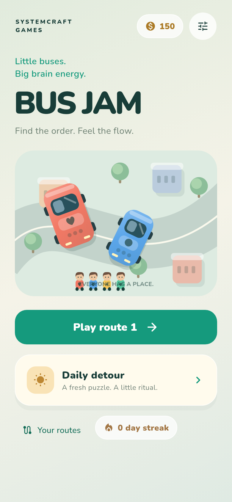
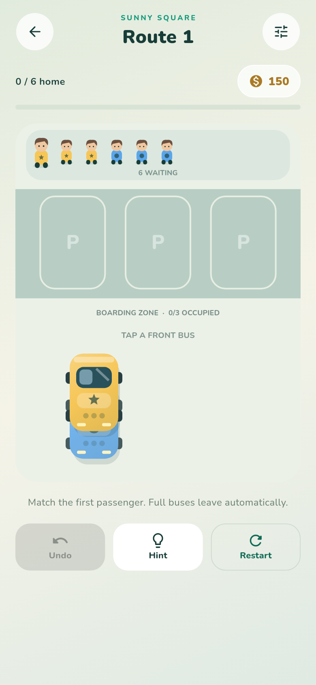

# Bus Jam

A Flutter/Dart color queue puzzle for iOS first, with Android and web sources.
Original vector buses and people, mint/cream city design, bundled Nunito typography,
boarding/departure animation, procedural sound, and an offline game engine.

 

## Play

Tap a **front bus** to send it into the boarding zone. Passengers board in FIFO
order and only enter a bus with the same color/symbol. A full bus departs. You win
when everyone has boarded and every bus has departed. A jam occurs when every
parking slot is occupied and the first passenger cannot board.

- Deterministic, validated procedural levels and tutorial routes.
- Solver-based hints, undo, restart, and one extra-slot continue per attempt.
- Exact mid-level saves and recovery from corrupt saves; serialized writes.
- Coins: 150 at install, 25 on first completion of a route, 75 on first daily win.
- Daily detours, consecutive-day streak, unlocked route map, replay protection.
- Sound/haptics/reduced-motion settings and color-independent passenger symbols.
- UMP-gated AdMob rewarded/interstitial adapters and verified StoreKit 2 Remove Ads.
- Conservative ad cadence, optional HTTPS config, persistent local analytics journal.

## Run and verify

Flutter **3.47.6** / Dart **3.13.5**, iOS deployment target **15.0**.

```sh
flutter pub get --enforce-lockfile
flutter run
bash tool/quality_gate.sh
flutter build web --release
```

The quality gate runs formatting, static analysis, automated/business/UI tests,
coverage, and 10,000 generated levels. See [test report](docs/TEST_REPORT.md) for
executed outcomes and platform limitations. Native checks are never inferred
from local or mocked tests.

## GitHub and iOS

All tests run in GitHub Actions: Linux for automated/business/widget checks and
standard macOS for native iPhone simulator acceptance and compilation.
Native screenshots/reports are capped at 16 MiB and retained for one day.
A private repository requires checking free allowance and blocked paid overage.
Codemagic has one manual workflow, `ios-testflight`: verify successful Actions
for the exact main commit, prepare signing, build IPA and upload to TestFlight.
It runs no tests and uses personal-account M2 included minutes only.
See [setup](docs/SETUP.md). Credentials never belong in this repository.

Bundle ID: `com.systemcraft.busJam`.
StoreKit product: `com.systemcraft.busJam.remove_ads` (non-consumable).
The committed AdMob app IDs are Google's sample IDs; ad units are unset by default.
Real monetization requires account configuration and native test-device/sandbox QA.
The signed internal TestFlight candidate enables those subsequent checks.
`tool/release_gate.py` blocks App Store release while their evidence is missing.
Android has shared gameplay/UI sources, but its billing adapter/release QA is a
future Android delivery task. This candidate is **not cleared for App Store release**.

## Structure

| Path | Responsibility |
| --- | --- |
| `lib/game/` | Immutable levels/boards, pure rules, solver, generator, controller |
| `lib/platform/` | Save adapters, local analytics, ads, StoreKit port, config |
| `lib/ui/` | Responsive screens and original canvas illustrations/animation |
| `ios/Runner/AppDelegate.swift` | Verified StoreKit 2 purchase/restore/revocation bridge |
| `test/` | Explicit expected business outcomes and UI acceptance journeys |
| `integration_test/` | Native player journey with screenshots |
| `tool/` | Quality, source identity, native QA and release gates |
| `docs/` | Product rules, setup, UAT/report and evidence |

Shared persistence and analytics interfaces were reused from Arrow Escape;
Bus Jam's rules remain independent of Flutter and provider SDKs.
Original art/audio are included. Nunito is SIL OFL; dependencies retain their
licenses. See [notices](docs/THIRD_PARTY_NOTICES.md).
