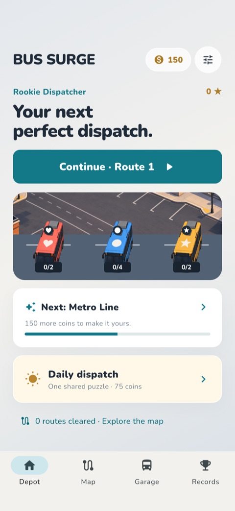
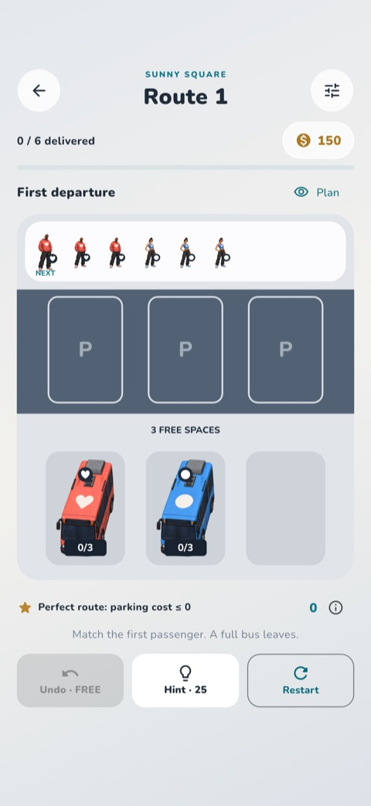

# Bus Surge

A Flutter/Dart color queue puzzle for iOS first, with Android and web sources.
Approved urban game sprites, adult passengers, city artwork and bundled Nunito typography,
overlapping boarding/departure motion, procedural sound, and an offline game engine.

Version 1.1 adds thirty authored planning puzzles, parking-efficiency scores,
stars, personal records and a coin-funded cosmetic garage. See
[redesign rules](docs/REDESIGN.md). Old saves retain their exact active board.

 

## Play

Tap a **front bus** to send it into the boarding zone. Passengers board in FIFO
order and only enter a bus with the same color/symbol. A full bus departs. You win
when everyone has boarded and every bus has departed. A jam occurs when every
parking slot is occupied and the first passenger cannot board.

- Thirty authored routes followed by deterministic, validated combinations.
- Immediate input during animation, hidden buses and different seat capacities.
- Solver-based hints, one free undo per attempt, restart, and an extra-slot continue.
- Exact mid-level saves and recovery from corrupt saves; serialized writes.
- Coins: 150 at install, 25 on first completion of a route, 75 on first daily win.
- Stars, parking-efficiency scores, personal records and dispatcher ranks.
- Five bus liveries and four terminal styles; unlock with coins and equip in play.
- Daily detours, consecutive-day streak, unlocked route map, replay protection.
- Optional Game Center daily board; account setup and real-device checks are separate.
- Sound/haptics/reduced-motion settings and color-independent passenger symbols.
- UMP-gated AdMob rewarded/interstitial adapters and verified StoreKit 2 Remove Ads.
- Conservative ad cadence, optional HTTPS config, persistent local analytics journal.

## Run and verify

Flutter **3.47.6** / Dart **3.13.5**, iOS deployment target **15.0**.

```sh
flutter pub get --enforce-lockfile
flutter run
bash tool/quality_gate.sh
flutter build web --release
```

The quality gate runs formatting, static analysis, automated/business/UI tests,
coverage, and 10,000 generated levels. See [test report](docs/TEST_REPORT.md) for
executed outcomes and platform limitations. Native checks are never inferred
from local or mocked tests.

## GitHub and iOS

All tests run in GitHub Actions: Linux for automated/business/widget checks and
standard macOS for native iPhone simulator acceptance and compilation.
Native screenshots/reports are capped at 16 MiB and retained for one day.
Inspected native JPEG previews and exact run outcomes are preserved in
[`docs/evidence/redesign/`](docs/evidence/redesign/) and [the test report](docs/TEST_REPORT.md).
A private repository requires checking free allowance and blocked paid overage.
Codemagic has one manual workflow, `ios-testflight`: verify successful Actions
for the exact main commit, prepare signing, build IPA and upload to TestFlight.
It runs no tests and uses personal-account M2 included minutes only.
See [setup](docs/SETUP.md). Credentials never belong in this repository.

Bundle ID: `com.systemcraft.busJam`.
StoreKit product: `com.systemcraft.busJam.remove_ads` (non-consumable).
The committed AdMob app IDs are Google's sample IDs; ad units are unset by default.
Real monetization requires account configuration and native test-device/sandbox QA.
The signed internal TestFlight candidate enables those subsequent checks.
`tool/release_gate.py` blocks App Store release while their evidence is missing.
Android has shared gameplay/UI sources, but its billing adapter/release QA is a
future Android delivery task. This candidate is **not cleared for App Store release**.

## Structure

| Path | Responsibility |
| --- | --- |
| `lib/game/` | Immutable levels/boards, pure rules, solver, generator, controller |
| `lib/platform/` | Save adapters, local analytics, ads, StoreKit port, config |
| `lib/ui/` | Responsive screens, cached urban sprites and boarding/departure animation |
| `ios/Runner/AppDelegate.swift` | Verified StoreKit 2 bridge and optional Game Center board |
| `test/` | Explicit expected business outcomes and UI acceptance journeys |
| `integration_test/` | Native player journey with screenshots |
| `tool/` | Quality, source identity, native QA and release gates |
| `docs/` | Product rules, setup, UAT/report and evidence |

Shared persistence and analytics interfaces were reused from Arrow Escape;
Bus Surge's rules remain independent of Flutter and provider SDKs.
Project-generated art and original audio are included. Nunito is SIL OFL; dependencies retain their
licenses. See [notices](docs/THIRD_PARTY_NOTICES.md).

## Artwork

The owner-approved urban game style is used for all illustrated subjects, the
home city, win/fail art and platform app icons. Assets are decoded
once before the first frame and shared by the home scene and gameplay painters.
Functional UI icons and matching marks remain crisp code/font geometry.
See [art direction](docs/ART_DIRECTION.md).
